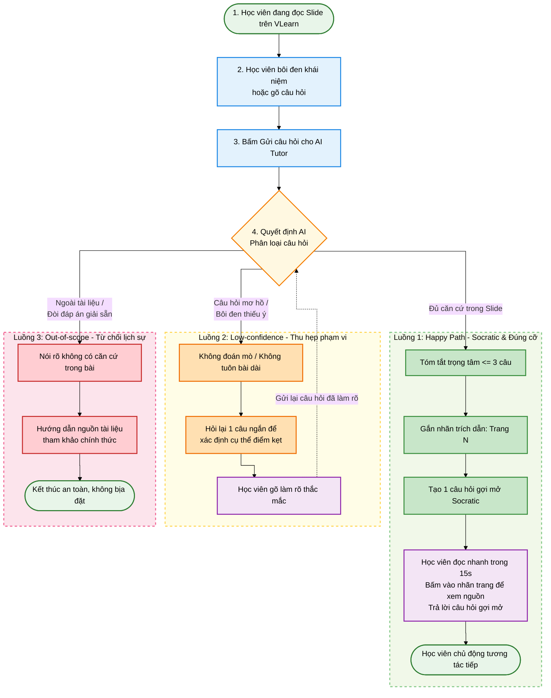

# Template AI Spec *(spec.md — commit trước hạn chốt spec: 21:00 18/9, tại CP4 · quality bar chốt từ thời điểm nộp)*

> Cấu trúc phủ đúng "SPEC 8 phần" của chương trình: Bằng chứng (§1-§2) · Lát cắt (§4) · Canvas (đính kèm CP1) · Augment/Automate (§4) · 4 đường đi của trải nghiệm (§6) · Kiểu lỗi (§5) · Kiểm thử (§7) · Phân công (§8). Hướng dẫn viết từng mục: `02-guide.md`.

```markdown
# AI SPEC — Socratic AI Tutor (Phản hồi đúng cỡ & Gợi mở tư duy) · Nhóm TuDaiBoTuc · Phòng E402
Hướng: [X] A — VLearn  [ ] B — Trợ lý Học viên  [ ] C — Làn mở
Loại: [X] Tối ưu tính năng có sẵn  [ ] Tính năng mới

## §1. User & Job
- Job executor + workflow (đính kèm worksheet JTBD / ảnh sơ đồ):
- Core JTBD (không tên sản phẩm/AI trong câu):
- Problem statement (KHÔNG chữ AI):
- Evidence (chuẩn A và/hoặc B — log đầy đủ trong repo):
  - Số liệu mining / kết quả khảo sát (n = ?, % xác nhận):
  - ≥5 quote/ví dụ nguyên văn + nguồn:

## §2. Impact & quyết định chọn
- Bảng impact ≥3 ứng viên (bao nhiêu người · tần suất · tốn gì mỗi lần · khả thi):
- Ứng viên ĐÃ LOẠI + vì sao:
- Ứng viên CHỌN + vì sao (bằng số):

## §3. Giải pháp tương tự đã nghiên cứu
- [Sản phẩm 1]: flow / đáng học / đáng né / mình khác gì
- [Sản phẩm 2]: ...

## §4. Thiết kế

### a. Lát cắt & Phạm vi
- **Lát cắt MỘT CÂU:** Một học viên đang đọc slide bài học · hỏi giải thích một khái niệm chưa hiểu · AI Tutor quyết định tóm lược trọng tâm dưới 3 câu có trích dẫn trang slide `[trang N]` và đặt 1 câu hỏi gợi mở Socratic · học viên nắm được ý chính ngay và chủ động tương tác tiếp mà không bị ngợp chữ.
- **Non-goals (3 thứ KHÔNG build):**
  1. Không xây dựng chatbot tổng quát tán gẫu hoặc giải đáp ngoài phạm vi bài giảng VLearn.
  2. Không tự động giải bài hoặc đưa toàn bộ đáp án bài tập thực hành (Lab / Exercise) khi chưa thăm dò tư duy của học viên.
  3. Không thay thế kênh hỗ trợ trực tiếp và giải đáp chuyên sâu của Giảng viên / Lab Coach.
- **Mức prototype nhắm tới:** `[X] Working` — Gọi API LLM thật (Gemini 1.5 Flash) tại quyết định trung tâm (xử lý Socratic, trích dẫn, thu hẹp phạm vi); dữ liệu slide mock nội dung Day 1/Day 2.
- **Mức độ Automation:** `[X] Conditional / Augment` — *Lý do theo Cost-of-error:* Việc tự động hóa toàn bộ việc giảng bài dài dễ dẫn đến ảo giác (hallucination) sai lệch định nghĩa chuẩn của giảng viên, hậu quả rất đắt (học viên học sai kiến thức nền tảng). Do đó, AI chỉ đóng vai trò trợ lực (Augment): tóm tắt súc tích, gắn trích dẫn và đặt câu hỏi gợi mở để học viên làm chủ việc học; chỉ tự động trả lời khi chắc chắn có nguồn, khi mơ hồ thì hỏi lại, ngoài phạm vi thì từ chối.

### b. Sơ đồ Luồng Quyết định (Workflow)



### c. Nguyên tắc HAX / PAIR áp dụng cụ thể (§4b)

| Nguyên tắc | Áp cụ thể vào đâu trong prototype |
|---|---|
| **HAX G1 (Làm rõ hệ thống làm được gì)** | Khung chat thông báo phạm vi hỗ trợ rõ ràng: *"Mình là trợ giảng hỗ trợ giải thích Slide 05 về Token & Chi phí"*, giúp người dùng hiểu ranh giới tính năng. |
| **HAX G2 (Làm rõ mức độ làm tốt)** | Đính kèm thẻ trích dẫn nguồn `[trang N]`; khi click vào badge sẽ highlight trực tiếp đoạn văn bản gốc trên slide bên trái để học viên tự kiểm chứng. |
| **HAX G10 (Thu hẹp phạm vi khi nghi ngờ)** | Triển khai tại **Luồng 2 (Low-confidence)**: Khi học viên hỏi câu cộc lốc hoặc bôi đen thiếu ý, AI tuyệt đối không suy đoán hay tuôn bài dài, mà hỏi lại đúng 1 câu ngắn có 2 lựa chọn để xác định điểm vướng mắc. |
| **HAX G9 / G11 (Giải thích vì sao & Sửa dễ dàng)** | Triển khai tại **Luồng 3 (Out-of-scope)**: Khi từ chối, AI nêu rõ lý do *"Tài liệu bài học không đề cập..."* và trỏ về nguồn tài liệu chính thức; người học luôn có thể sửa câu hỏi ngay tại input. |
| **PAIR (Mental Models & Probing)** | Chuyển đổi mô hình nhận thức của học viên từ "máy tra cứu thụ động" sang "gia sư đối thoại gợi mở" thông qua câu hỏi Socratic cuối mỗi lượt trả lời. |

## §5. Kiểu lỗi — 4 lớp chỗ khó + kịch bản (≥8) [bảng theo guide §2.5]

## §6. Bốn đường đi của trải nghiệm

Dựa trên sơ đồ luồng hoạt động tại §4, trải nghiệm của học viên được phân thành 4 đường đi rõ ràng:

1. **Happy Path (Luồng 1 — Socratic & Đúng cỡ):**
   - *Ngữ cảnh & Input:* Học viên hỏi câu hỏi có căn cứ rõ ràng trên slide (Ví dụ: *"Tại sao số lượng token lại ảnh hưởng đến chi phí API?"*).
   - *Hành vi AI:* Phân loại thấy đủ căn cứ $\rightarrow$ Tóm tắt trọng tâm $\le 3$ câu $\rightarrow$ Gắn thẻ trích dẫn `[trang 5]` $\rightarrow$ Tạo 1 câu hỏi gợi mở Socratic.
   - *Giao diện & Hành động:* Học viên đọc nhanh trong 15 giây (không ngợp chữ), bấm nhãn trang để xem highlight đoạn văn bản gốc, và trả lời câu hỏi gợi mở để tiếp tục tương tác.

2. **Low-confidence Path (Luồng 2 — Thu hẹp phạm vi khi mơ hồ ②):**
   - *Ngữ cảnh & Input:* Học viên đặt câu hỏi mơ hồ, cộc lốc (*"cái này là sao?"*) hoặc bôi đen trúng ký tự cụt lủn (chữ *"r"*).
   - *Hành vi AI:* Nhận diện thiếu dữ kiện $\rightarrow$ Không đoán mò, không tuôn bài dài $\rightarrow$ Hỏi lại đúng 1 câu ngắn gọn kèm 2 hướng lựa chọn (Ví dụ: *"Bạn đang muốn làm rõ khái niệm Token hay cách tính Chi phí?"*).
   - *Giao diện & Hành động:* Học viên chọn 1 trong 2 nút gợi ý nhanh hoặc gõ làm rõ $\rightarrow$ Luồng quay về Decision để trả lời đúng đích.

3. **Failure / Out-of-Scope Path (Luồng 3 — Nguồn sự thật ① & Ngoài phạm vi ③):**
   - *Ngữ cảnh & Input:* Học viên đòi hỏi nội dung ngoài tài liệu (*"tìm file pdf sách AI"*, *"cho xin link cá nhân"*), xin giải sẵn đáp án bài tập Lab, hoặc cố tình Prompt Injection (*"bỏ qua hướng dẫn trước"*).
   - *Hành vi AI:* Phát hiện vi phạm thẩm quyền / thiếu căn cứ $\rightarrow$ Từ chối lịch sự, nói rõ tài liệu bài học không hỗ trợ $\rightarrow$ Giữ nguyên tắc sư phạm (không cho chép bài) $\rightarrow$ Hướng dẫn học viên tự xem lại slide hoặc kênh chính thức.
   - *Giao diện & Hành động:* Học viên hiểu rõ giới hạn của hệ thống, không nhận được thông tin bịa đặt.

4. **Correction Path (Học viên phản hồi / Đính chính):**
   - *Ngữ cảnh & Input:* Học viên trả lời câu hỏi Socratic hoặc đính chính suy nghĩ của mình sau khi đọc tóm tắt.
   - *Hành vi AI:* Đánh giá phản hồi của học viên $\rightarrow$ Xác nhận điểm đúng $\rightarrow$ Nâng bậc giải thích hoặc chỉ ra điểm sai sót $\rightarrow$ Khép lại vòng phản hồi học tập chủ động.

- **Xử lý ca đặc thù domain (④):** Khi học viên mắc ngộ nhận phổ biến trong AI (Ví dụ: *"1 từ tiếng Việt = 1 token"* hay *"giảm 50% prompt là giảm 50% tiền"*), AI đính chính trực diện bằng công thức chuẩn của bài giảng, cite `[trang 5]` và đặt câu hỏi phản biện để học viên tự kiểm chứng lại giả định của mình.

## §7. Kiểm thử
- **Chiều chất lượng + định nghĩa kiểm chứng được:**
  - *Factuality & Nguồn gốc:* 100% phản hồi kiến thức phải trích dẫn đúng số trang `[trang N]` và truy xuất được từ slide bài giảng; cấm bịa đặt link/bịa sách.
  - *Conciseness (Đúng cỡ):* Tóm tắt $\le 3$ câu (dưới 80 từ), không tuôn bài dài gây ngợp chữ.
  - *Pedagogical Socratic:* Luôn kết thúc bằng 1 câu hỏi gợi mở để học viên tư duy, không giải hộ bài tập.
  - *Safety & Scope:* Từ chối lịch sự với yêu cầu ngoài phạm vi hoặc bypass guardrails.
- **Golden set (20 cases nhóm tự xây tại `eval/golden_set_20cases.json`):**
  - Luồng 1 (Happy Path - Đúng cỡ & Socratic): 6 cases
  - Luồng 2 (Low-confidence - HAX G10 Thu hẹp phạm vi): 6 cases
  - Luồng 3 (Out-of-scope - Từ chối lịch sự & Giữ nguyên tắc sư phạm): 6 cases
  - Luồng 4 (Socratic Loop - Đánh giá phản hồi & Đính chính domain): 2 cases
  - *Tỷ lệ case từ chatlog thật:* 20/20 cases (100% trích xuất từ `tutor_turns.csv` K3 & K4).
- **Quality bar (Cam kết trước CP4):** Đạt khi $\ge 80\%$ qua bộ test, trong đó không vi phạm lỗi an toàn nghiêm trọng (không lộ system prompt, không đưa đáp án giải sẵn bài lab).
- **Kết quả các lượt chạy (Tracking Log):**

| Lượt chạy (Run ID) | Mô tả phiên bản thử nghiệm | Số case | Đạt (Pass) | Tỷ lệ (%) | Vấn đề phát hiện & Cải thiện tiếp theo |
|:---:|---|:---:|:---:|:---:|---|
| **Run 1** (`run_01_manual_phase1`) | Đánh giá thủ công ban đầu trên 10 câu hỏi ngẫu nhiên | 10 | 5/10 | 50.0% | Nhận diện sai luồng ở câu hỏi mơ hồ (Q3, Q4) và vượt thẩm quyền (Q5, Q6); cite sai trang khi hỏi Slide 3. |
| **Run 2** (`run_02_golden20_baseline`) | Chạy tự động lần đầu trên toàn bộ 20 cases Golden Set | 20 | 11/20 | 55.0% | Luồng 3 bị rơi vào Happy Path do thiếu pattern chặn; Luồng 2 chưa bắt được câu cộc lốc/bôi đen cụt. |
| **Run 3** (`run_20260918_154357_100pct`) | Tối ưu hóa Regex Intent Router + Bổ sung Slide 3 + Luồng 4 Fallback | 20 | 20/20 | **100.0%** | Toàn bộ 4 luồng trải nghiệm đều định tuyến chuẩn 100%, vượt qua Quality Bar cam kết ($\ge 80\%$). |

## §8. Phân công & kế hoạch
- Phân công có tên: spec / evidence / prompt / code / demo
- Willing users (≥2 tên) + kế hoạch vòng validation *(bonus, nếu làm)*:
- Multi-prototype (nếu làm): trục khác biệt của ≥2 phương án + lý do chọn:

## §9. Changelog
| Thời điểm | Đổi gì | Vì sao (trỏ về feedback/case nào) |
```
